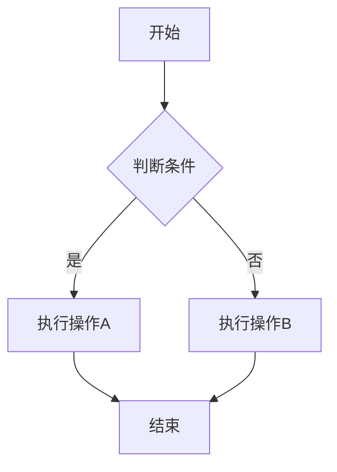
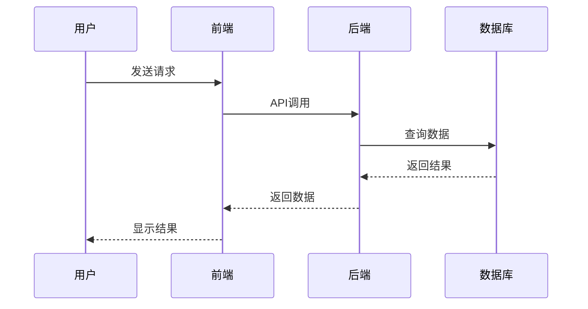
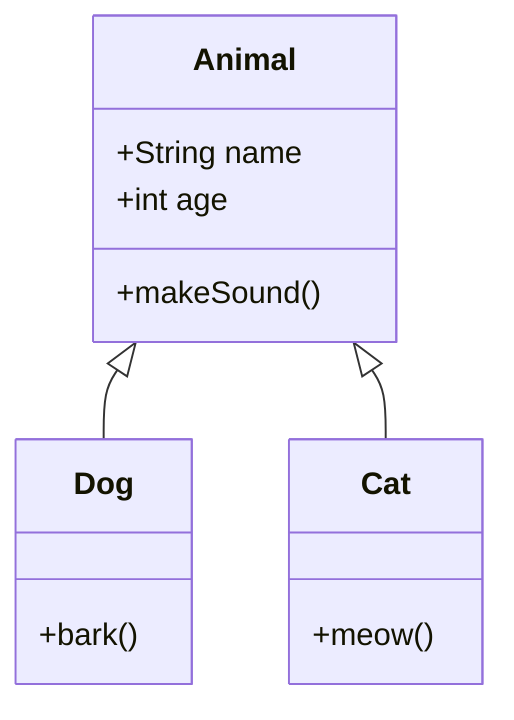
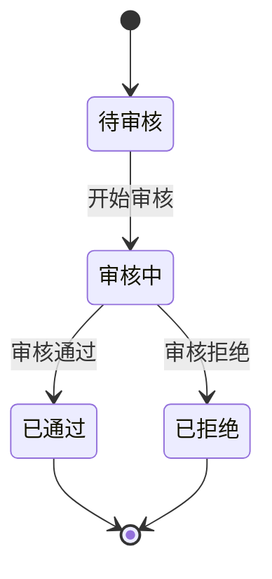
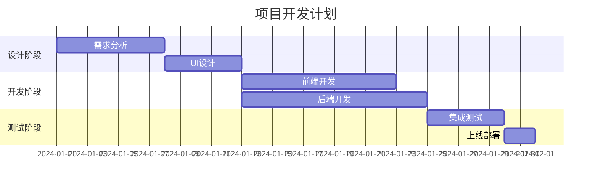
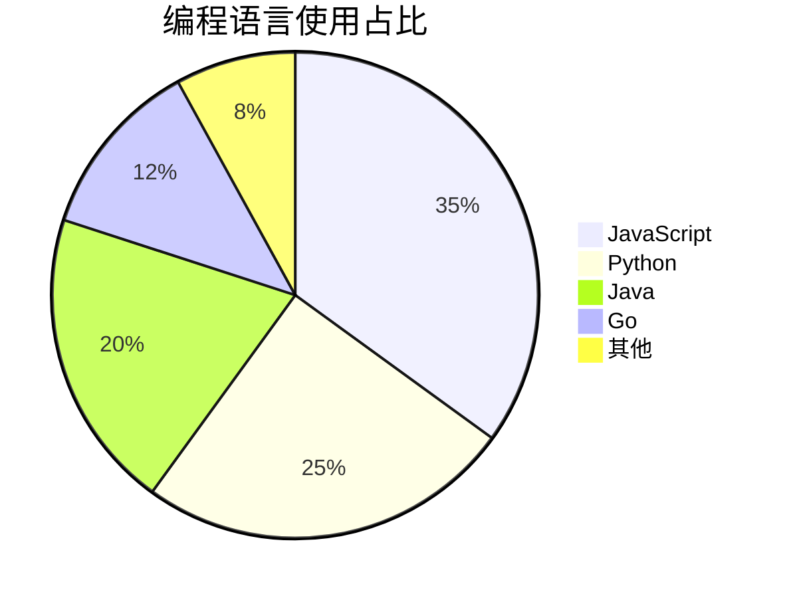
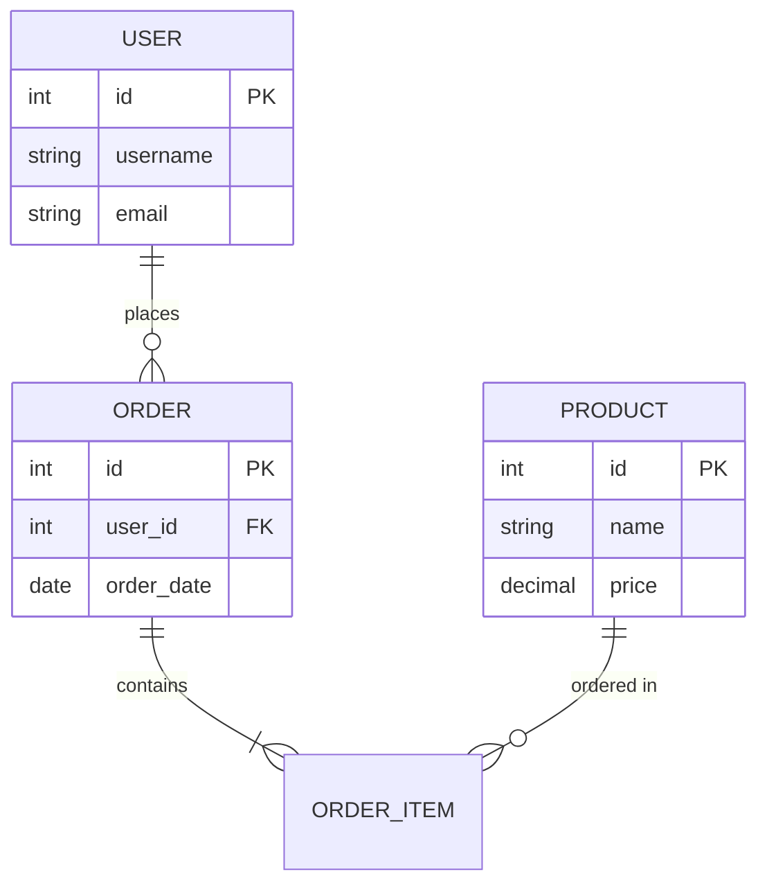
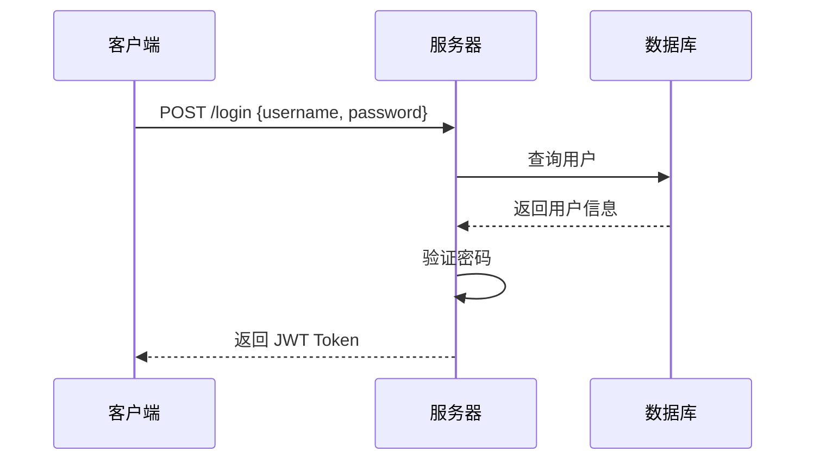

# Markdown 高级功能使用示例

## 1. 数学公式（LaTeX）

### 行内公式
使用单个 `$` 包裹公式：

```markdown
这是一个行内公式：$E = mc^2$，爱因斯坦的质能方程。

勾股定理：$a^2 + b^2 = c^2$
```

**效果：**
这是一个行内公式：$E = mc^2$，爱因斯坦的质能方程。

### 块级公式
使用双 `$$` 包裹公式：

```markdown
$$
\int_{-\infty}^{\infty} e^{-x^2} dx = \sqrt{\pi}
$$
```

**效果：**
$$
\int_{-\infty}^{\infty} e^{-x^2} dx = \sqrt{\pi}
$$

### 更多数学公式示例

#### 矩阵
```markdown
$$
\begin{bmatrix}
a & b \\
c & d
\end{bmatrix}
$$
```

#### 求和
```markdown
$$
\sum_{i=1}^{n} i = \frac{n(n+1)}{2}
$$
```

#### 分数
```markdown
$$
\frac{d}{dx}\left(\frac{1}{x}\right) = -\frac{1}{x^2}
$$
```

#### 希腊字母
```markdown
$\alpha, \beta, \gamma, \Delta, \Omega$
```

---

## 2. Mermaid 图表

### 流程图
````markdown

````

### 时序图
````markdown

````

### 类图
````markdown

````

### 状态图
````markdown

````

### 甘特图
````markdown

````

### 饼图
````markdown

````

### ER图（实体关系图）
````markdown

````

---

## 3. 代码高亮

### Python
````markdown
```python
def fibonacci(n):
    """计算斐波那契数列"""
    if n <= 1:
        return n
    return fibonacci(n-1) + fibonacci(n-2)

# 测试
for i in range(10):
    print(f"F({i}) = {fibonacci(i)}")
```
````

### JavaScript
````markdown
```javascript
// React 组件示例
const Counter = () => {
  const [count, setCount] = useState(0);
  
  return (
    <div>
      <p>Count: {count}</p>
      <button onClick={() => setCount(count + 1)}>
        Increment
      </button>
    </div>
  );
};
```
````

### Java
````markdown
```java
public class HelloWorld {
    public static void main(String[] args) {
        System.out.println("Hello, World!");
        
        // 使用 Stream API
        List<Integer> numbers = Arrays.asList(1, 2, 3, 4, 5);
        int sum = numbers.stream()
                        .mapToInt(Integer::intValue)
                        .sum();
    }
}
```
````

### SQL
````markdown
```sql
SELECT 
    u.username,
    COUNT(o.id) as order_count,
    SUM(o.total_amount) as total_spent
FROM users u
LEFT JOIN orders o ON u.id = o.user_id
WHERE o.created_at >= '2024-01-01'
GROUP BY u.id, u.username
HAVING COUNT(o.id) > 5
ORDER BY total_spent DESC;
```
````

---

## 4. 表格

### 基础表格
```markdown
| 姓名 | 年龄 | 职位 |
|------|------|------|
| 张三 | 28 | 工程师 |
| 李四 | 32 | 设计师 |
| 王五 | 25 | 产品经理 |
```

### 对齐方式
```markdown
| 左对齐 | 居中对齐 | 右对齐 |
|:-------|:--------:|-------:|
| 内容1  | 内容2    | 内容3  |
| A      | B        | C      |
```

---

## 5. 列表

### 任务列表
```markdown
- [x] 完成需求分析
- [x] 设计数据库
- [ ] 实现API接口
- [ ] 编写测试用例
- [ ] 部署上线
```

### 嵌套列表
```markdown
1. 第一项
   - 子项 1.1
   - 子项 1.2
     - 子子项 1.2.1
2. 第二项
   1. 子项 2.1
   2. 子项 2.2
```

---

## 6. 引用和提示

### 普通引用
```markdown
> 这是一段引用文本。
> 可以包含多行。
>
> 甚至可以包含段落。
```

### 嵌套引用
```markdown
> 第一层引用
>> 第二层引用
>>> 第三层引用
```

---

## 7. 链接和图片

### 链接
```markdown
[普通链接](https://example.com)
[带标题的链接](https://example.com "这是标题")
```

### 图片
```markdown


```

---

## 8. 综合示例

### 技术文档示例

````markdown
# 用户认证系统

## 概述
本系统实现了基于 JWT 的用户认证功能。

## 流程图


## 核心算法

JWT Token 生成公式：

$$
Token = Base64(Header) + "." + Base64(Payload) + "." + HMAC(Secret, Data)
$$

## 代码实现

```python
import jwt
from datetime import datetime, timedelta

def generate_token(user_id: int) -> str:
    """生成 JWT Token"""
    payload = {
        'user_id': user_id,
        'exp': datetime.utcnow() + timedelta(days=7)
    }
    return jwt.encode(payload, SECRET_KEY, algorithm='HS256')
```

## 性能指标

| 指标 | 数值 | 说明 |
|------|------|------|
| QPS | 10000+ | 每秒查询数 |
| 响应时间 | <50ms | 平均响应时间 |
| 成功率 | 99.9% | 认证成功率 |

## 任务清单

- [x] 实现登录接口
- [x] 实现 Token 验证
- [ ] 添加刷新 Token 功能
- [ ] 实现单点登录
````

---

## 9. 注意事项

### 数学公式
- 使用 `$` 包裹行内公式
- 使用 `$$` 包裹块级公式
- 支持完整的 LaTeX 语法
- 公式中的特殊字符需要转义

### Mermaid 图表
- 代码块语言标记为 `mermaid`
- 支持多种图表类型
- 图表会异步渲染
- 复杂图表可能需要一些时间

### 代码高亮
- 支持 100+ 种编程语言
- 自动检测语言（如果未指定）
- 所有代码块都有复制按钮
- 使用 Atom One Dark 主题

---

## 10. 更多资源

- [KaTeX 支持的函数](https://katex.org/docs/supported.html)
- [Mermaid 文档](https://mermaid.js.org/)
- [Highlight.js 支持的语言](https://github.com/highlightjs/highlight.js/blob/main/SUPPORTED_LANGUAGES.md)
- [Markdown 语法指南](https://www.markdownguide.org/)
