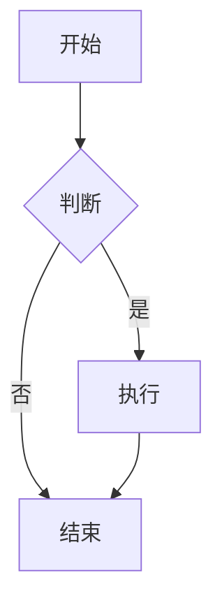

# Markdown 渲染方案说明

## 方案一：简化版本（已实现）✅

### 已安装的依赖
```bash
npm install marked highlight.js dompurify @types/marked @types/dompurify
```

### 功能特性
- ✅ 完整的 Markdown 语法支持（标题、列表、表格、引用、链接等）
- ✅ 代码语法高亮（支持100+种编程语言）
- ✅ 代码块复制按钮
- ✅ XSS 防护（使用 DOMPurify）
- ✅ 美观的样式（GitHub 风格）
- ✅ 响应式设计
- ✅ 适合内网环境（所有资源本地化）

### 文件结构
```
src/
├── utils/
│   └── markdown.ts          # Markdown 渲染工具
├── assets/
│   └── styles/
│       └── markdown.css     # Markdown 样式
└── views/
    └── ConversationView.vue # 已集成
```

### 使用方法
```typescript
import { renderMarkdown, setupCopyCode } from '@/utils/markdown';
import 'highlight.js/styles/atom-one-dark.css';  // 代码高亮主题
import '@/assets/styles/markdown.css';            // Markdown 样式

// 在 onMounted 中初始化
onMounted(() => {
  setupCopyCode();
});

// 渲染 Markdown
<div class="markdown-content" v-html="renderMarkdown(content)"></div>
```

### 支持的 Markdown 语法示例

#### 1. 标题
```markdown
# H1 标题
## H2 标题
### H3 标题
```

#### 2. 列表
```markdown
- 无序列表项 1
- 无序列表项 2
  - 嵌套项

1. 有序列表项 1
2. 有序列表项 2
```

#### 3. 代码块
````markdown
```python
def hello_world():
    print("Hello, World!")
```
````

#### 4. 表格
```markdown
| 列1 | 列2 | 列3 |
|-----|-----|-----|
| 数据1 | 数据2 | 数据3 |
```

#### 5. 引用
```markdown
> 这是一段引用文本
> 可以多行
```

#### 6. 链接和图片
```markdown
[链接文本](https://example.com)

```

#### 7. 强调
```markdown
**粗体文本**
*斜体文本*
~~删除线~~
`行内代码`
```

---

## 方案二：完整版本（可选升级）

如果需要更高级的功能，可以安装以下依赖：

### 额外依赖
```bash
# 数学公式支持
npm install katex @types/katex

# Mermaid 图表支持
npm install mermaid

# Emoji 支持
npm install markdown-it-emoji

# 目录生成
npm install markdown-it-anchor markdown-it-toc-done-right
```

### 高级功能
- 📐 数学公式渲染（LaTeX）
- 📊 流程图、时序图、甘特图（Mermaid）
- 😀 Emoji 表情支持
- 📑 自动生成目录
- 🔗 标题锚点链接
- 📋 任务列表（Todo List）

### 数学公式示例
```markdown
行内公式：$E = mc^2$

块级公式：
$$
\int_{-\infty}^{\infty} e^{-x^2} dx = \sqrt{\pi}
$$
```

### Mermaid 图表示例
````markdown

````

---

## 代码高亮主题

### 可选主题（在 `ConversationView.vue` 中修改）

```typescript
// 暗色主题
import 'highlight.js/styles/atom-one-dark.css';      // 当前使用 ✅
import 'highlight.js/styles/github-dark.css';
import 'highlight.js/styles/vs2015.css';
import 'highlight.js/styles/monokai.css';

// 亮色主题
import 'highlight.js/styles/github.css';
import 'highlight.js/styles/atom-one-light.css';
import 'highlight.js/styles/vs.css';
```

---

## 性能优化建议

### 1. 懒加载语言包
如果只需要特定语言的高亮，可以按需导入：

```typescript
import hljs from 'highlight.js/lib/core';
import python from 'highlight.js/lib/languages/python';
import javascript from 'highlight.js/lib/languages/javascript';
import java from 'highlight.js/lib/languages/java';

hljs.registerLanguage('python', python);
hljs.registerLanguage('javascript', javascript);
hljs.registerLanguage('java', java);
```

### 2. 缓存渲染结果
对于不变的内容，可以缓存渲染结果：

```typescript
const renderedCache = new Map<string, string>();

function cachedRenderMarkdown(markdown: string): string {
  if (renderedCache.has(markdown)) {
    return renderedCache.get(markdown)!;
  }
  const result = renderMarkdown(markdown);
  renderedCache.set(markdown, result);
  return result;
}
```

---

## 内网部署注意事项

### 1. 所有依赖都已本地化
- ✅ `marked` - Markdown 解析器
- ✅ `highlight.js` - 代码高亮
- ✅ `dompurify` - XSS 防护
- ✅ 样式文件都在本地

### 2. 不依赖外部 CDN
所有资源都通过 npm 安装，打包后完全离线可用。

### 3. 字体建议
如果需要更好的代码显示效果，建议在内网服务器上部署等宽字体：
- Consolas（Windows 自带）
- Monaco（macOS 自带）
- Fira Code（开源，支持连字）
- JetBrains Mono（开源）

---

## 故障排除

### 1. 代码高亮不生效
检查是否导入了高亮主题 CSS：
```typescript
import 'highlight.js/styles/atom-one-dark.css';
```

### 2. 样式不生效
确保导入了 Markdown 样式：
```typescript
import '@/assets/styles/markdown.css';
```

### 3. 复制按钮不工作
确保调用了 `setupCopyCode()`：
```typescript
onMounted(() => {
  setupCopyCode();
});
```

### 4. XSS 警告
DOMPurify 会自动清理危险的 HTML，如果需要允许特定标签，修改 `markdown.ts` 中的 `ALLOWED_TAGS`。

---

## 更新日志

### v1.0.0 (2025-10-28)
- ✅ 实现基础 Markdown 渲染
- ✅ 集成代码语法高亮
- ✅ 添加代码复制功能
- ✅ 实现 XSS 防护
- ✅ 创建美观的样式
- ✅ 集成到 ConversationView

---

## 参考资源

- [Marked 文档](https://marked.js.org/)
- [Highlight.js 文档](https://highlightjs.org/)
- [DOMPurify 文档](https://github.com/cure53/DOMPurify)
- [GitHub Markdown 规范](https://github.github.com/gfm/)
