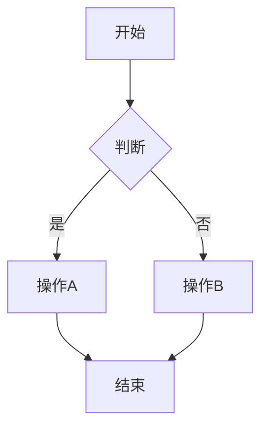
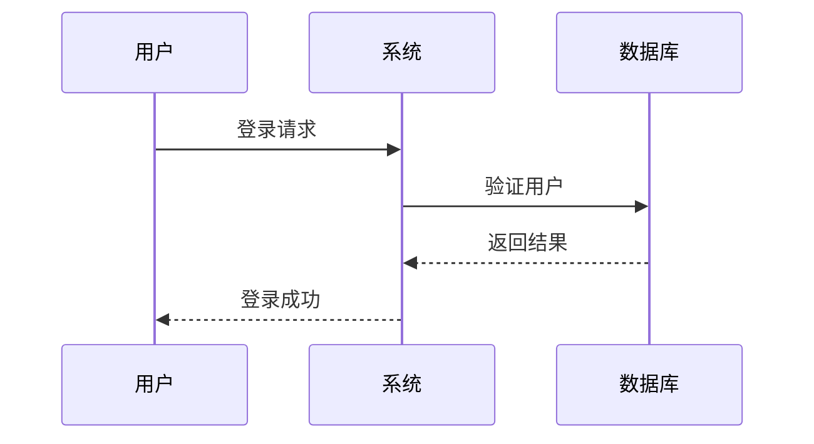
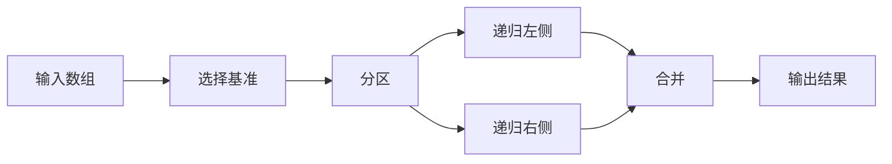

# Markdown 功能测试

复制下面的内容到对话框中测试各种功能：

---

## 测试 1: 基础 Markdown

**粗体文本** *斜体文本* ~~删除线~~ `行内代码`

### 列表测试
- 项目 1
- 项目 2
  - 嵌套项 2.1
  - 嵌套项 2.2

1. 有序列表 1
2. 有序列表 2

---

## 测试 2: 数学公式

行内公式：质能方程 $E = mc^2$

块级公式：
$$
\int_{-\infty}^{\infty} e^{-x^2} dx = \sqrt{\pi}
$$

二次方程求根公式：
$$
x = \frac{-b \pm \sqrt{b^2 - 4ac}}{2a}
$$

---

## 测试 3: 代码高亮

```python
def hello_world():
    print("Hello, World!")
    for i in range(5):
        print(f"Number: {i}")
```

```javascript
const greeting = (name) => {
  console.log(`Hello, ${name}!`);
};
greeting("World");
```

---

## 测试 4: Mermaid 流程图



---

## 测试 5: Mermaid 时序图



---

## 测试 6: 表格

| 功能 | 状态 | 说明 |
|------|------|------|
| 代码高亮 | ✅ | 支持100+语言 |
| 数学公式 | ✅ | LaTeX语法 |
| Mermaid | ✅ | 多种图表 |

---

## 测试 7: 引用

> 这是一段引用文本
> 支持多行引用
>> 嵌套引用也可以

---

## 完整示例

### 算法说明

快速排序的时间复杂度为 $O(n \log n)$

算法流程：



代码实现：

```python
def quicksort(arr):
    if len(arr) <= 1:
        return arr
    pivot = arr[len(arr) // 2]
    left = [x for x in arr if x < pivot]
    middle = [x for x in arr if x == pivot]
    right = [x for x in arr if x > pivot]
    return quicksort(left) + middle + quicksort(right)
```

性能分析：

| 情况 | 时间复杂度 |
|------|-----------|
| 最好 | $O(n \log n)$ |
| 平均 | $O(n \log n)$ |
| 最坏 | $O(n^2)$ |
